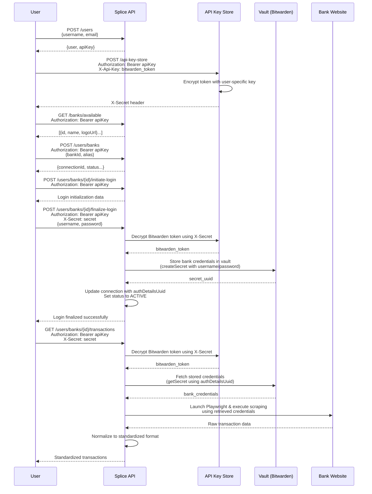

# Splice 🔗

A self-hosted, extensible financial transaction aggregation API. Alternative to Plaid for banks without OAuth support.

**Current Status**: POC supporting DBS Singapore checking/savings accounts.

> 🚨 **Security Warning**: Splice handles sensitive financial credentials. Read [Security](#security) before self-hosting.

## Quick Start

### Prerequisites
- [Bun](https://bun.sh) >= 1.0
- [Docker](https://docker.com) for PostgreSQL
- [Bitwarden](https://bitwarden.com/products/secrets-manager/) Secrets Manager account

### Installation

```bash
git clone <repo-url>
cd splice
bun install
```

### Environment Setup

```bash
cd packages/splice-service
cp .env.example .env
```

Configure `.env`:
- `API_STORE_ENCRYPTION_KEY` - Generate with `openssl rand -hex 32`
- `POSTGRES_*` - Database configuration
- `JWT_SECRET` - Generate with `openssl rand -hex 32`

### Development

```bash
# Start database
bun run db

# Start development server
bun run dev
```

API available at `http://localhost:3000` with docs at `/api`

## Usage

### Step 1: Create User & Get API Key

```bash
curl -X POST http://localhost:3000/users \
  -H "Content-Type: application/json" \
  -d '{
    "username": "your_username",
    "email": "your_email@example.com"
  }'
```

**Response**: You'll receive a user object and an `apiKey` for Bearer authentication:
```json
{
  "user": { ... },
  "apiKey": "your_api_key"
}
```

### Step 2: Store Bitwarden Token & Get X-Secret

```bash
curl -X POST http://localhost:3000/api-key-store \
  -H "Authorization: Bearer your_api_key" \
  -H "X-Api-Key: your_bitwarden_access_token" \
  -H "Content-Type: application/json" \
  -d '{
    "keyType": "BITWARDEN",
    "organisationId": "your_organisation_id"
  }'
```

**Response**: Save the `X-Secret` from response headers - you'll need it for credential operations.

### Step 3: Get Available Banks

```bash
curl -X GET http://localhost:3000/banks/available \
  -H "Authorization: Bearer your_api_key"
```

**Response**: List of available banks with their IDs and details.

### Step 4: Create Bank Connection

```bash
curl -X POST http://localhost:3000/users/banks \
  -H "Authorization: Bearer your_api_key" \
  -H "Content-Type: application/json" \
  -d '{
    "bankId": "dbs_bank_id",
    "alias": "My DBS Savings"
  }'
```

**Response**: Bank connection object with `connectionId`.

### Step 5: Bank Login (Two-Part Process)

**Initiate Login:**
```bash
curl -X POST http://localhost:3000/users/banks/{connectionId}/initiate-login \
  -H "Authorization: Bearer your_api_key"
```

**Finalize Login:**
```bash
curl -X POST http://localhost:3000/users/banks/{connectionId}/finalize-login \
  -H "Authorization: Bearer your_api_key" \
  -H "X-Secret: your_x_secret" \
  -H "Content-Type: application/json" \
  -d '{
    "username": "your_bank_username",
    "password": "your_bank_password"
  }'
```

### Step 6: Fetch Transactions

```bash
curl -X GET http://localhost:3000/users/banks/{connectionId}/transactions \
  -H "Authorization: Bearer your_api_key" \
  -H "X-Secret: your_x_secret"
```

**Response**: Array of standardized transactions.

## Flow Diagram



## API Client

Install the TypeScript client:

```bash
bun add @splice/api-client
```

```typescript
import { SpliceApiClient } from '@splice/api-client';

const client = new SpliceApiClient({
  baseUrl: 'http://localhost:3000',
  apiKey: 'your-api-key'
});

// Create user
const { user, apiKey } = await client.users.create('username', 'email@example.com');

// Set JWT for authenticated requests
client.setJwt(apiKey);

// Create bank connection
const connection = await client.bankConnections.create({
  bankId: 'dbs',
  bitwardenSecretId: 'secret-uuid'
});
```

## Architecture

```
splice/
├── packages/
│   ├── splice-api/           # Shared TypeScript types
│   ├── splice-api-client/    # HTTP client library
│   └── splice-service/       # Main NestJS application
│       ├── src/
│       │   ├── auth/         # JWT authentication
│       │   ├── users/        # User management
│       │   ├── bank-connections/ # Bank connection management
│       │   ├── api-key-store/    # Encrypted credential storage
│       │   ├── vault/        # Bitwarden integration
│       │   └── scraper/      # Web scraping + strategies
│       └── test/             # Unit and E2E tests
```

**Core Flow**:
1. User creates account → receives JWT API key
2. User stores encrypted Bitwarden token
3. User creates bank connection with Bitwarden secret ID
4. Transactions fetched via automated browser scraping

## Adding Banks

Create strategy in `packages/splice-service/src/scraper/strategies/`:

```typescript
@Injectable()
export class YourBankStrategy implements ScraperStrategy {
  name = 'your_bank';
  startUrl = 'https://your-bank-login-url.com';

  async scrape(secret: string, page: Page, logger: Logger): Promise<ScrapedData> {
    // 1. Parse credentials from Bitwarden secret
    // 2. Navigate login flow
    // 3. Extract transaction data
    // 4. Return normalized transactions
  }
}
```

Register in `scraper.module.ts` and add secret UUID to config.

## Development

```bash
# Run tests
bun run test
bun run test:e2e

# Lint and format
bun run lint
bun run format

# Build
bun run build
```

## Security

**Encryption**: AES-256-GCM with PBKDF2 key derivation (100k iterations)
- Master key from `API_STORE_ENCRYPTION_KEY`
- Per-user keys derived with UUID salt
- Bitwarden tokens encrypted at rest

**Authentication**: JWT Bearer tokens with configurable expiration

> ⚠️ **Risk**: Self-hosting credential aggregation carries inherent security risks. Ensure proper infrastructure security.

## Technologies

- **Backend**: NestJS + TypeORM + PostgreSQL
- **Scraping**: Playwright
- **Security**: Bitwarden Secrets Manager
- **Auth**: JWT with Passport
- **Docs**: Scalar API Reference