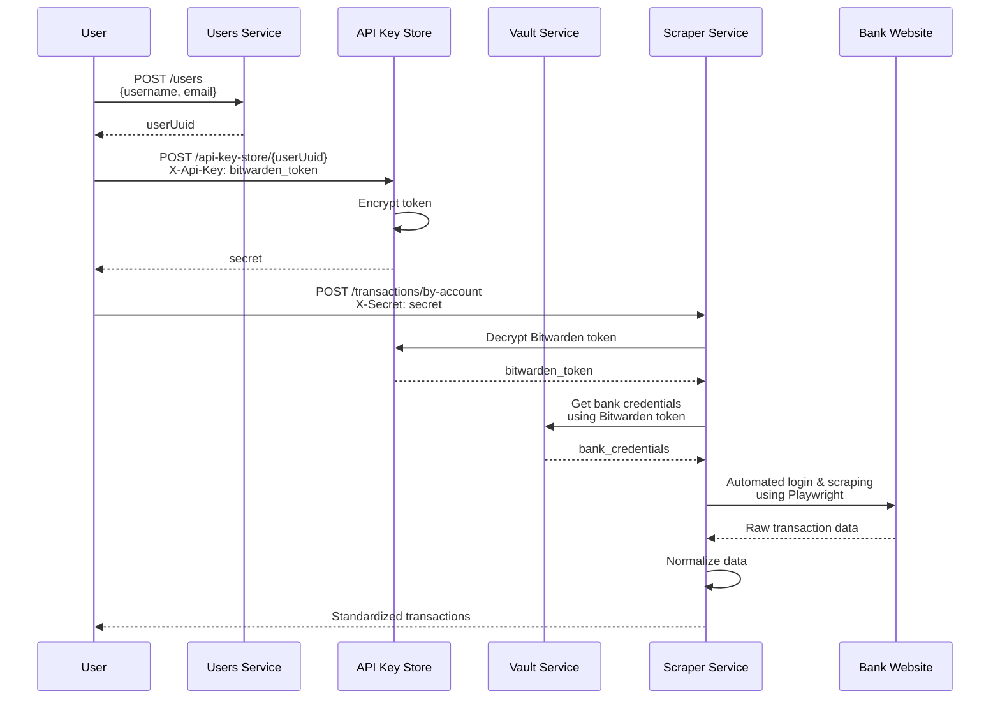

# Splice 🔗

An open-source, self-hosted, and extensible alternative to Plaid's transaction API. Splice allows you to aggregate and normalize financial transaction data from any source while maintaining full control over your data and infrastructure.

**The current implementation is a POC** with support for checking/savings accounts in DBS Singapore accounts.

> 🚨 **Important**: Splice handles sensitive financial credentials. Before proceeding, please read the [Security](#-security) section to understand the security implications and risks of self-hosting Splice.

## 🌟 Features

- Self-hosted solution for financial data aggregation
- [Extensible architecture for adding new data sources](#-adding-new-financial-services)
  - Playwright integration for financial services without APIs

## 🚀 Getting started

### Installation

1. Clone the repository:
```bash
git clone <repo-url>
cd splice-service
```

2. Install dependencies:
```bash
npm install
```

3. Set up your environment variables:
```bash
cp .env.example .env
```

Edit the `.env` file with your configuration:
- `DBS_SECRET_UUID`: UUID of DBS secret stored in Bitwarden
- `API_STORE_ENCRYPTION_KEY`: Encryption key for sensitive data (generate with `openssl rand -hex 32`)
- Database configuration:
  - `POSTGRES_USER`
  - `POSTGRES_PASSWORD`
  - `POSTGRES_DB`
  - `POSTGRES_HOST`
  - `POSTGRES_PORT`

### Running Splice

1. Start the database:
```bash
npm run db
```

2. Start the development server:
```bash
npm run dev
```

## 📝 Usage

1. Create a [Bitwarden Secrets Manager](https://bitwarden.com/products/secrets-manager/) account and generate a Machine Account Access Token from their dashboard.

2. Create a secret in Bitwarden with your financial service credentials
  * See `parseCredentialsFromSecret` in [dbs.strategy.ts](splice-service/src/scraper/strategies/dbs.strategy.ts) to understand how secret values should be formatted

2. Create a user in Splice:
```bash
curl -X POST http://localhost:3000/users \
  -H "Content-Type: application/json" \
  -d '{"username": "your_username", "email": "your_email@example.com"}'
```
Response will include your `userUuid`.

3. Store your Bitwarden access token:
```bash
curl -X POST http://localhost:3000/api-key-store/<your-user-uuid>?keyType=BITWARDEN \
  -H "X-Api-Key: your_bitwarden_access_token"
```
Save the returned secret from the `X-Secret` response header.

4. Fetch financial transactions:
```bash
curl -X POST "http://localhost:3000/transactions/by-account?accountName=dbs&userUuid=<your-user-uuid>" \
  -H "X-Secret: your_splice_secret"
```

Note: The `accountName` parameter corresponds to the financial service strategy name in the codebase (e.g., ["dbs" for DBS Bank](splice-service/src/scraper/strategies/dbs.strategy.ts)).

## 🔄 Flow diagram



## 🔒 Security
> ⚠️ Please submit an issue for recommendations on improving security. Options are limited for banks that do not provide OAuth support

Splice uses AES-256-GCM encryption to securely store Bitwarden access tokens. Here's how it works:

1. A master encryption key is derived from your `API_STORE_ENCRYPTION_KEY` environment variable
2. For each user, a unique encryption key is derived using:
   - PBKDF2 key derivation with 100,000 iterations
   - SHA-256 hashing
   - The user's UUID as salt
3. When storing an API key:
   - A random initialization vector (IV) is generated
   - The data is encrypted using AES-256-GCM with the user's unique key
   - The IV and authentication tag are combined to create a secret returned to the user
4. For subsequent requests for financial data:
   - The user provides their secret in the X-Secret header
   - Splice uses this to decrypt their stored API keys and retrieve the relevant financial service's credentials

The implementation can be found in [splice-service/src/api-key-store/api-key-store.service.ts](splice-service/src/api-key-store/api-key-store.service.ts).

> ⚠️ **Security Considerations**: While the Bitwarden access token is encrypted, storing access tokens that can retrieve financial service credentials represents a significant security risk.
>
> **Do consider this risk when deciding to self-host Splice**

## 🔧 Adding a new financial service

Splice is designed to be extensible. You can add support for new financial institutions by implementing a scraping strategy:

1. Create a new strategy file in `splice-service/src/scraper/strategies/`:
```typescript
@Injectable()
export class YourBankStrategy implements ScraperStrategy {
  name = 'your_bank';  // This will be the accountName in API requests
  startUrl = 'https://your-bank-login-url.com';

  async scrape(secret: string, page: Page, logger: Logger): Promise<ScrapedData> {
    // 1. Parse credentials from secret (stored in Bitwarden)
    // 2. Navigate through login flow
    // 3. Extract and normalize transaction data
    // 4. Return standardized transaction data
  }
}
```

2. Register your strategy in [splice-service/src/scraper/scraper.module.ts](splice-service/src/scraper/scraper.module.ts):
```typescript
const STRATEGIES = [DBSStrategy, YourBankStrategy] as const;
```

3. Add the secret UUID to your environment configuration:
```typescript
bitwarden: {
  secrets: {
    dbs: 'existing-uuid',
    your_bank: 'your-secret-uuid'
  }
}
```

The scraper service will automatically:
- Initialize a Playwright browser instance
- Load your strategy when requested
- Fetch credentials from Bitwarden
- Provide error handling and logging

See [splice-service/src/scraper/strategies/dbs.strategy.ts](splice-service/src/scraper/strategies/dbs.strategy.ts) for a complete example implementation.

## 🚀 Future improvements
- Implement 2FA requirement when attempting to decrypt access tokens using secrets
  - Adds an additional layer of security, mitigate risks if a secret is compromised

- Store list of financial services per user and their corresponding secret UUIDs

## 📁 Project structure

```
splice
├── splice-api             # Shared types and interfaces
└── splice-service         # Main service implementation
    ├── src
    │   ├── api-key-store  # Encrypted storage for API keys
    │   ├── scraper        # Web scraping infrastructure
    │   │   └── strategies # Bank-specific scraping implementations
    │   ├── users          # User management
    │   └── vault          # Bitwarden Secrets Manager integration
    ├── downloads          # Temporary storage for downloaded statements
    └── screenshots        # Optional scraping debug screenshots
```

## 🏗️ Architecture

Splice is built on:
- NestJS + TypeORM for backend
- PostgreSQL for data storage
- Playwright for scraper functionality
- Bitwarden Secrets Manager to store bank login details
